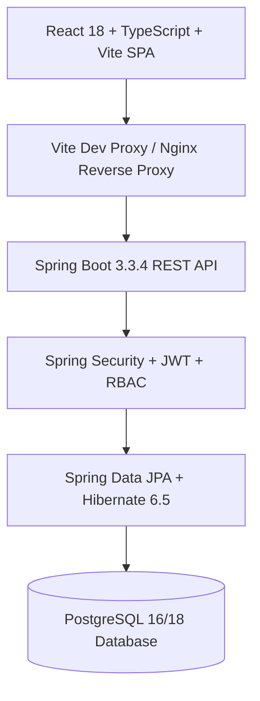

# KiranaPro POS — Scalable Kirana Store Management & Billing System

A complete, production-ready, scalable **Kirana Store Management & Point-of-Sale (POS) System** designed specifically for Indian retail grocery stores, supermarkets, and multi-branch retail chains.

---

## 🌟 Key Highlights & Business Capabilities

1. **High-Speed POS Billing Screen**:
   - Continuous barcode scanning input with automatic product lookup and auto-focus.
   - Quick category pills (Grocery, Dairy, Beverages, Personal Care, Household, Snacks) & instant touch-card selection.
   - Dynamic real-time calculations: Subtotal, item-level discounts, bill-level discounts, HSN-based GST (0%, 5%, 12%, 18%, 28%), CGST/SGST/IGST breakdown, and cash round-off.
   - Split & Multi-payment support: Cash (with tendered change calculation), dynamic UPI QR code generator, Card POS terminals, and Customer Udhaar / Khata credit.
   - Dual-layout invoice printing: **80mm thermal receipt printer** format & **Standard A4 tax invoice** format.

2. **Multi-Batch FEFO Inventory Engine**:
   - First-Expiry, First-Out (FEFO) automated dispatch algorithm.
   - Multi-batch tracking with supplier lot numbers, manufacturing dates, expiry dates, cost price, and MRP.
   - Expiry alert horizon indicators (Near-expiry within 30 days in orange, Expired in red).
   - Pessimistic write-locking on inventory batches to prevent overselling race conditions during peak checkout hours.
   - Physical audit stock adjustments with audited reasons (`DAMAGED`, `EXPIRED`, `THEFT_OR_LOST`, `COUNTING_ERROR`).

3. **Customer Khata (Udhaar / Credit Book)**:
   - Full digital ledger with strict double-entry credit/debit tracking.
   - Automatic balance updates when credit sales are made and repayments are received.
   - Customer credit limits, transaction histories, and printable account statements.

4. **Inward Stock Purchases (GRN)**:
   - Supplier purchase order receipts with auto-batch creation.
   - Tracks supplier payables, invoice numbers, tax inputs, and payment statuses (`PAID`, `PARTIAL`, `UNPAID`).

5. **Sales Returns & Bill Voiding**:
   - Itemized sales returns with restock-to-inventory flags.
   - Flexible refund methods: Cash, UPI, or Khata credit.
   - Audited bill cancellation with automatic inventory reversal and Khata ledger rollback.

6. **Financial Reports & GSTR-1 Compliance**:
   - Accurate Profit & Loss on actual **Cost of Goods Sold (COGS)** basis (`Net Sales - COGS = Gross Profit`).
   - GSTR-1 compliant tax summary categorized by GST slabs (0%, 5%, 12%, 18%, 28%).
   - One-click CSV / Excel export.

7. **Multi-Store Ready Tenancy**:
   - Clean data model hierarchy: `Business -> Store -> Users / Inventory / Sales / Customers`.
   - Global product master catalog with store-specific inventory batches and store configurations.

8. **Security & Immutable Audit Trail**:
   - Stateless JWT authentication with BCrypt password hashing.
   - Role-Based Access Control (RBAC): `ROLE_ADMIN`, `ROLE_MANAGER`, `ROLE_CASHIER`.
   - Complete audit logging of pricing changes, stock adjustments, bill cancellations, and logins.

---

## 🏗️ Architecture & Technology Stack



| Component | Technology | Version | Purpose |
|---|---|---|---|
| **Backend** | Java / Spring Boot | Java 21 LTS, Spring Boot 3.3.4 | Core REST APIs, transaction management, security |
| **Persistence** | Spring Data JPA / Hibernate | 6.5.3.Final | ORM, CriteriaBuilder specifications, FEFO queries |
| **Database** | PostgreSQL | 16 / 18 | ACID relational database with foreign keys & indexes |
| **Migrations** | Flyway | 10.x | Version-controlled database schema migrations |
| **Security** | Spring Security + JJWT | 0.12.5 | Stateless JWT authentication, password hashing |
| **Frontend** | React + TypeScript + Vite | React 18.3, Vite 5.4, TS 5.4 | High-performance SPA with type safety |
| **UI Library** | Material UI (MUI) | 5.15 | Clean retail design system, responsive layouts |
| **Charts** | Recharts | 2.12 | Interactive analytics charts (Area, Bar, Pie) |
| **Icons** | Lucide React | 0.395 | Modern UI icons |
| **Container** | Docker & Docker Compose | Compose v3.8 | Multi-stage production container orchestration |

---

## 👥 Default Demo Credentials

The database migration automatically seeds three active user accounts:

| Username | Password | Role | Permissions |
|---|---|---|---|
| `admin` | `admin123` | `ROLE_ADMIN` | Full access: POS, Inventory, P&L Reports, Khata, Settings, Audits |
| `manager` | `manager123` | `ROLE_MANAGER` | POS, Products, Purchases, Inventory, Reports, Returns |
| `cashier` | `cashier123` | `ROLE_CASHIER` | High-speed POS billing, Scan, Checkout, Thermal Receipt Printing |

*(Password hashes are stored in the database using BCrypt).*

---

## 🚀 Getting Started Locally

### Prerequisites

1. **Java 21 LTS** installed (`java -version`).
2. **Apache Maven 3.9+** installed (`mvn -version`).
3. **Node.js 20+** and **npm** installed (`node -v`).
4. **PostgreSQL** running locally on port `5432` with a database named `kirana_db` (or run via Docker).

### Step 1: Database Setup

Ensure PostgreSQL is running and create the database if not present:
```sql
CREATE DATABASE kirana_db;
```

### Step 2: Run Backend (Spring Boot)

From the project root:
```bash
cd backend
mvn spring-boot:run
```
- The backend will start on: `http://localhost:8080`
- Flyway automatically applies `V1__init_schema.sql` and `V2__seed_initial_data.sql`.
- Interactive Swagger / OpenAPI documentation is available at: `http://localhost:8080/swagger-ui.html`
- OpenAPI JSON specification: `http://localhost:8080/v3/api-docs`

### Step 3: Run Frontend (React + Vite)

From another terminal:
```bash
cd frontend
npm install
npm run dev
```
- The frontend will start on: `http://localhost:3000`
- Vite dev server proxies `/api` calls directly to `http://localhost:8080`.
- Open `http://localhost:3000` in your browser.
- Click on **Admin** for one-click demo login, or enter `admin` / `admin123`.

---

## 🐳 Docker Deployment

To launch the complete multi-tier system with PostgreSQL, Spring Boot backend, and Nginx-powered React frontend:

```bash
docker-compose up --build -d
```

Containers launched:
1. `kirana_postgres`: PostgreSQL container on port `5432` with healthcheck.
2. `kirana_backend`: Multi-stage Spring Boot JAR on port `8080`.
3. `kirana_frontend`: Multi-stage Nginx container on port `3000`.

To stop the system:
```bash
docker-compose down
```

---

## 🧪 Automated Testing

### Backend Integration Tests

Run the JUnit 5 test suite verifying authentication, barcode search, GST calculations, FEFO batch allocation, and Khata ledger accounting:
```bash
cd backend
mvn test
```

### End-to-End Automated Workflow Test

An automated script `e2e-workflow-test.ps1` executes the 12-step commercial Kirana lifecycle:
```powershell
powershell -ExecutionPolicy Bypass -File .\e2e-workflow-test.ps1
```
Workflow verified:
1. Authenticate Admin via JWT
2. Create Product with Barcode and GST rate
3. Record Inward Purchase from Supplier
4. Verify Inventory Batch Creation (50 units)
5. Scan Product Barcode at POS
6. Create Bill with Split Payment (Cash + UPI) and GST
7. Verify Inventory Deducted (50 -> 46 units)
8. Verify Profit & Loss Report on COGS basis
9. Process Customer Sales Return
10. Verify Restocked Inventory (46 -> 47 units)
11. Record Customer Khata Repayment
12. Verify Audit Log Trail

---

## 📂 Project Structure

```
kirana-store-system/
├── backend/
│   ├── src/main/java/com/kirana/
│   │   ├── config/             # SecurityConfig, OpenApiConfig, CorsConfig
│   │   ├── controller/         # 13 REST Controllers (Auth, POS, Inventory, etc.)
│   │   ├── dto/                # Request & Response DTOs
│   │   ├── entity/             # 22 JPA Entities (Store, Product, Batch, Sale, Khata)
│   │   ├── repository/         # 19 Spring Data JPA Repositories
│   │   ├── security/           # JWT Provider, AuthFilter, UserPrincipal
│   │   ├── service/            # Core business logic (FEFO, GST, P&L, Khata)
│   │   └── specification/      # Type-safe CriteriaBuilder query filters
│   ├── src/main/resources/
│   │   ├── application.yml     # Database, JWT, JPA configuration
│   │   └── db/migration/       # Flyway V1 DDL & V2 seed data migrations
│   ├── Dockerfile
│   └── pom.xml
├── frontend/
│   ├── src/
│   │   ├── components/         # AppLayout, PrintInvoiceModal
│   │   ├── contexts/           # AuthContext, ThemeContext (Light/Dark Emerald)
│   │   ├── pages/              # 13 Rich Pages (Pos, Dashboard, Khata, Inventory, etc.)
│   │   ├── services/           # Axios API client with JWT interceptor
│   │   ├── types/              # Comprehensive TypeScript interfaces
│   │   ├── App.tsx             # Protected routes with RBAC guards
│   │   ├── main.tsx
│   │   └── index.css
│   ├── Dockerfile
│   ├── package.json
│   └── vite.config.ts
├── docs/
│   ├── ARCHITECTURE.md         # Detailed modular monolith architecture
│   ├── DATABASE.md             # ER diagrams and database schema reference
│   └── API.md                  # REST API contract documentation
├── docker-compose.yml
├── e2e-workflow-test.ps1        # Automated E2E verification test script
└── README.md
```

---

## 🧾 License

This software is developed for commercial Kirana store and retail enterprise operations.
