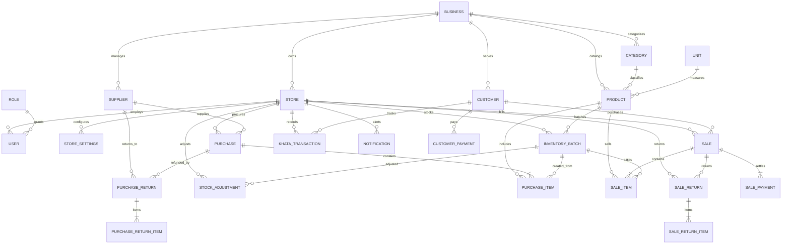

# Database Schema & Entity-Relationship Design
## Kirana Store Management & POS System

### 1. Entity-Relationship Diagram (Mermaid)



---

### 2. Complete Relational Table Specifications

#### 1. `businesses`
| Column | Type | Constraints | Description |
|---|---|---|---|
| `id` | BIGSERIAL | PRIMARY KEY | Unique business identifier |
| `name` | VARCHAR(150) | NOT NULL | Business entity legal/trade name |
| `trade_name` | VARCHAR(150) | NULL | Neighborhood store branding name |
| `tax_number` | VARCHAR(50) | NULL | PAN or corporate tax identifier |
| `created_at` | TIMESTAMPTZ | NOT NULL DEFAULT NOW() | Registration date |
| `updated_at` | TIMESTAMPTZ | NOT NULL DEFAULT NOW() | Last update timestamp |

#### 2. `stores`
| Column | Type | Constraints | Description |
|---|---|---|---|
| `id` | BIGSERIAL | PRIMARY KEY | Unique store identifier |
| `business_id` | BIGINT | NOT NULL FK -> businesses(id) | Associated business |
| `name` | VARCHAR(150) | NOT NULL | Branch / Store name |
| `code` | VARCHAR(20) | NOT NULL UNIQUE | Branch code (e.g. STR-001) |
| `address` | TEXT | NOT NULL | Physical street address |
| `city` | VARCHAR(100) | NOT NULL | City |
| `state` | VARCHAR(100) | NOT NULL | State (for Intra/Inter-state GST) |
| `pincode` | VARCHAR(10) | NOT NULL | Postal code |
| `phone` | VARCHAR(20) | NOT NULL | Store contact phone |
| `email` | VARCHAR(100) | NULL | Store official email |
| `gstin` | VARCHAR(15) | NULL | Indian 15-digit GSTIN |
| `invoice_prefix` | VARCHAR(10) | NOT NULL DEFAULT 'INV' | Invoice sequence prefix |
| `invoice_next_seq`| BIGINT | NOT NULL DEFAULT 1 | Sequential bill counter |
| `is_active` | BOOLEAN | NOT NULL DEFAULT TRUE | Operational status |
| `created_at` | TIMESTAMPTZ | NOT NULL DEFAULT NOW() | Creation timestamp |
| `updated_at` | TIMESTAMPTZ | NOT NULL DEFAULT NOW() | Modification timestamp |

#### 3. `roles` & `users`
| Column | Type | Constraints | Description |
|---|---|---|---|
| `users.id` | BIGSERIAL | PRIMARY KEY | Unique user ID |
| `business_id` | BIGINT | NOT NULL FK -> businesses(id) | Business affiliation |
| `store_id` | BIGINT | NULL FK -> stores(id) | Assigned store (NULL for global Admin) |
| `role` | VARCHAR(30) | NOT NULL | ROLE_ADMIN, ROLE_MANAGER, ROLE_CASHIER |
| `username` | VARCHAR(50) | NOT NULL UNIQUE | System login username |
| `password_hash`| VARCHAR(255) | NOT NULL | BCrypt hashed password |
| `full_name` | VARCHAR(100) | NOT NULL | User's legal name |
| `phone` | VARCHAR(20) | NULL | Contact mobile number |
| `is_active` | BOOLEAN | NOT NULL DEFAULT TRUE | Account state |
| `created_at` | TIMESTAMPTZ | NOT NULL DEFAULT NOW() | Registration date |
| `updated_at` | TIMESTAMPTZ | NOT NULL DEFAULT NOW() | Last updated |

#### 4. `units` & `categories`
- `units`: `id`, `name` (Kg, Gram, Liter, Piece, Packet, Box, Dozen), `code` (kg, g, l, pc, pkt, box, doz), `allow_decimals` (BOOLEAN).
- `categories`: `id`, `business_id` (FK), `name`, `slug`, `description`, `is_active`, `created_at`.

#### 5. `products`
| Column | Type | Constraints | Description |
|---|---|---|---|
| `id` | BIGSERIAL | PRIMARY KEY | Product primary key |
| `business_id` | BIGINT | NOT NULL FK -> businesses(id) | Owning business |
| `category_id` | BIGINT | NOT NULL FK -> categories(id) | Product category |
| `unit_id` | BIGINT | NOT NULL FK -> units(id) | Unit of measurement |
| `name` | VARCHAR(200) | NOT NULL | Product trade title |
| `barcode` | VARCHAR(100) | NULL UNIQUE | EAN-13, UPC, or custom barcode |
| `sku` | VARCHAR(100) | NOT NULL UNIQUE | Unique Stock Keeping Unit |
| `brand` | VARCHAR(100) | NULL | Brand / Manufacturer |
| `hsn_code` | VARCHAR(20) | NULL | Indian GST HSN / SAC Code |
| `gst_rate` | NUMERIC(5,2) | NOT NULL DEFAULT 0.00 | GST percentage (0, 5, 12, 18, 28) |
| `default_cost_price` | NUMERIC(12,2) | NOT NULL DEFAULT 0.00 | Default procurement price |
| `default_selling_price`| NUMERIC(12,2)| NOT NULL DEFAULT 0.00 | Default store selling price |
| `default_mrp` | NUMERIC(12,2) | NOT NULL DEFAULT 0.00 | Maximum Retail Price |
| `min_stock_level` | NUMERIC(12,3) | NOT NULL DEFAULT 5.000 | Low stock warning trigger |
| `reorder_level` | NUMERIC(12,3) | NOT NULL DEFAULT 10.000 | Stock reorder recommendation |
| `image_url` | VARCHAR(500) | NULL | Product thumbnail URL |
| `description` | TEXT | NULL | Item specifications |
| `is_active` | BOOLEAN | NOT NULL DEFAULT TRUE | Catalog active state |
| `created_at` | TIMESTAMPTZ | NOT NULL DEFAULT NOW() | Created date |
| `updated_at` | TIMESTAMPTZ | NOT NULL DEFAULT NOW() | Updated date |

#### 6. `inventory_batches` (FEFO Core)
| Column | Type | Constraints | Description |
|---|---|---|---|
| `id` | BIGSERIAL | PRIMARY KEY | Batch primary key |
| `store_id` | BIGINT | NOT NULL FK -> stores(id) | Branch location |
| `product_id` | BIGINT | NOT NULL FK -> products(id) | Catalog item |
| `batch_number` | VARCHAR(100) | NOT NULL | Manufacturer or inward batch code |
| `quantity` | NUMERIC(12,3) | NOT NULL CHECK (quantity >= 0) | Current remaining stock |
| `initial_quantity` | NUMERIC(12,3) | NOT NULL | Quantity originally received |
| `cost_price` | NUMERIC(12,2) | NOT NULL | Purchase cost per unit for this batch |
| `selling_price` | NUMERIC(12,2) | NOT NULL | Store selling price for this batch |
| `mrp` | NUMERIC(12,2) | NOT NULL | Maximum Retail Price for this batch |
| `expiry_date` | DATE | NULL | Expiration date |
| `status` | VARCHAR(20) | NOT NULL DEFAULT 'ACTIVE' | ACTIVE, DEPLETED, EXPIRED |
| `version` | BIGINT | NOT NULL DEFAULT 0 | Optimistic concurrency locking |
| `created_at` | TIMESTAMPTZ | NOT NULL DEFAULT NOW() | Inward creation timestamp |
| `updated_at` | TIMESTAMPTZ | NOT NULL DEFAULT NOW() | Last inventory transaction |

#### 7. `sales` & `sale_items`
- `sales`: `id`, `store_id`, `customer_id` (nullable), `cashier_id`, `invoice_number` (UNIQUE), `sale_date`, `subtotal`, `item_discount_total`, `bill_discount_rate`, `bill_discount_amount`, `taxable_amount`, `cgst_amount`, `sgst_amount`, `igst_amount`, `total_tax_amount`, `round_off`, `total_amount`, `total_cogs`, `gross_profit`, `paid_amount`, `status` (`COMPLETED`, `CANCELLED`, `PARTIALLY_RETURNED`, `FULLY_RETURNED`), `payment_status` (`PAID`, `PARTIAL`, `CREDIT`), `cancel_reason`, `notes`, `created_at`, `updated_at`.
- `sale_items`: `id`, `sale_id`, `product_id`, `inventory_batch_id`, `quantity` (NUMERIC 12,3), `unit_price`, `cost_price`, `discount_amount`, `taxable_amount`, `gst_rate`, `cgst_amount`, `sgst_amount`, `igst_amount`, `total_tax`, `line_total`, `line_cogs`, `line_profit`, `returned_quantity`.
- `sale_payments`: `id`, `sale_id`, `payment_method` (`CASH`, `UPI`, `CARD`, `UDHAAR`), `amount`, `transaction_ref`, `notes`, `created_at`.

#### 8. `customers` & `khata_transactions`
- `customers`: `id`, `business_id`, `name`, `phone` (indexed), `email`, `address`, `gstin`, `credit_limit`, `current_outstanding`, `is_active`, `created_at`.
- `khata_transactions`: `id`, `store_id`, `customer_id`, `type` (`DEBIT_SALE`, `CREDIT_PAYMENT`, `ADJUSTMENT`, `RETURN_CREDIT`), `reference_type` (`SALE`, `CUSTOMER_PAYMENT`, `SALE_RETURN`, `MANUAL`), `reference_id`, `amount`, `balance_after`, `notes`, `created_by`, `transaction_date`, `created_at`.
- `customer_payments`: `id`, `store_id`, `customer_id`, `payment_number`, `amount`, `payment_method` (`CASH`, `UPI`, `CARD`, `BANK_TRANSFER`), `reference_number`, `notes`, `payment_date`, `created_by`, `created_at`.

#### 9. `suppliers`, `purchases` & `purchase_items`
- `suppliers`: `id`, `business_id`, `name`, `contact_person`, `phone`, `email`, `address`, `gstin`, `outstanding_balance`, `is_active`, `created_at`.
- `purchases`: `id`, `store_id`, `supplier_id`, `invoice_number`, `purchase_date`, `subtotal`, `tax_amount`, `discount_amount`, `total_amount`, `paid_amount`, `payment_status`, `payment_method`, `notes`, `created_by`, `created_at`.
- `purchase_items`: `id`, `purchase_id`, `product_id`, `inventory_batch_id`, `batch_number`, `expiry_date`, `quantity`, `cost_price`, `gst_rate`, `gst_amount`, `total_amount`.

#### 10. `stock_adjustments`, `audit_logs`, `notifications`, & `store_settings`
- All fully modeled with indexed relations and strict audit tracking.

---

### 3. Database Indexes Strategy
```sql
-- Fast POS Barcode scan
CREATE INDEX idx_products_barcode ON products(barcode) WHERE barcode IS NOT NULL;
CREATE INDEX idx_products_sku ON products(sku);
CREATE INDEX idx_products_category ON products(category_id);

-- FEFO Batch Search
CREATE INDEX idx_batches_fefo ON inventory_batches(store_id, product_id, status, expiry_date);

-- Invoice & Sales Querying
CREATE UNIQUE INDEX idx_sales_invoice ON sales(invoice_number);
CREATE INDEX idx_sales_store_date ON sales(store_id, sale_date DESC);
CREATE INDEX idx_sales_customer ON sales(customer_id);

-- Customer Phone lookup for POS Khata
CREATE INDEX idx_customers_phone ON customers(phone);
CREATE INDEX idx_khata_customer ON khata_transactions(customer_id, transaction_date DESC);

-- Supplier Phone lookup
CREATE INDEX idx_suppliers_phone ON suppliers(phone);

-- Audit & Notifications
CREATE INDEX idx_audit_created ON audit_logs(created_at DESC);
CREATE INDEX idx_notifications_unread ON notifications(store_id, is_read, created_at DESC);
```
